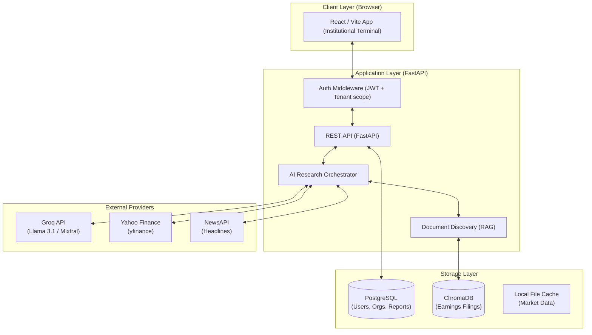
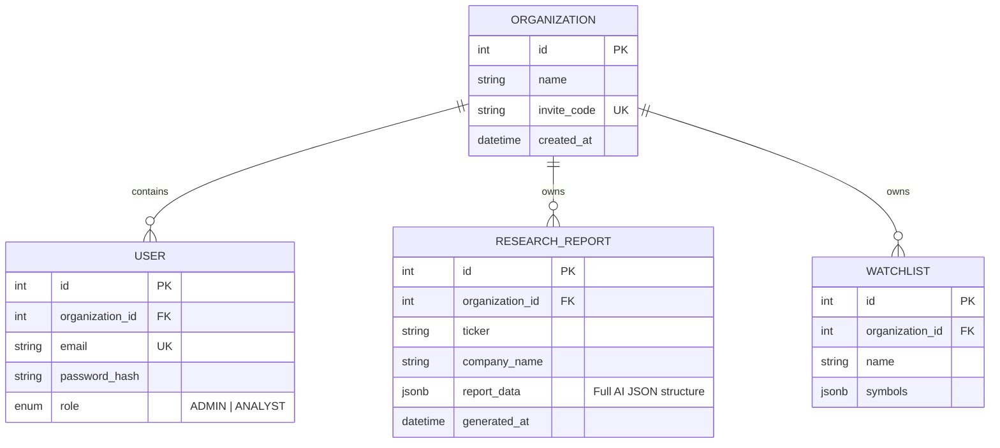

# KlypSearch System Architecture

## 1. High-Level System Architecture

The KlypSearch terminal is built on a modern, multi-tenant AI stack designed for high-fidelity financial research.



---

## 2. Information Journey & Data Flow

When a user requests a research report for a ticker (e.g., "NVDA"), the system executes the following pipeline:

```mermaid
sequenceDiagram
    participant User
    participant Frontend
    participant API
    participant RAG
    participant Groq
    participant DB

    User->>Frontend: Primary Search ("NVDA")
    Frontend->>API: POST /research/analyze { ticker: "NVDA" }
    Note over API: Middleware: Validate JWT & Organization Context
    
    parallel_fetch:
        API->>RAG: Retrieve Top-K chunks from ChromaDB
        API->>External: Fetch Yahoo Finance & News
    end
    
    API->>Groq: Build Multi-Signal Prompt (JSON Output)
    Groq-->>API: Returns Institutional Synthesis (JSON)
    API->>API: Normalize Probabilities & Format Output
    API->>DB: Persist Report (Organization Scoped)
    API-->>Frontend: Render Report UI
    Frontend-->>User: Display Terminal View
```

---

## 3. Database Schema (Multi-Tenant Model)

KlypSearch uses an **Organization-based isolation model** where all primary entities are discriminator-tagged with an `organization_id`.



---

## 4. AI Orchestration Strategy

The `ai_research_service` transforms raw signals into narrative synthesis using a structured reasoning engine.

1.  **Signal Aggregation**: The orchestrator collects 5 primary signal blocks:
    *   **Fundamental**: P/E, EPS, Revenue Growth, Debt/Equity.
    *   **Technical**: RSI (Overbought/Oversold), MACD, Golden/Death Crosses.
    *   **Risk**: Volatility, Sharpe Ratio, Max Drawdown, Beta.
    *   **Sentiment**: News headline scores and Analyst Consensus.
    *   **Qualitative (RAG)**: Contextual chunks from earnings filings.
2.  **Synthesis Engine**: Instead of prompting the LLM for a simple summary, KlypSearch uses **Institutional Reasoning Rules**:
    *   Conflict Resolution: e.g., "If fundamentals are strong but technicals are weak, explain the tension."
    *   Probability Weighting: Conviction scores represent the alignment (or lack thereof) across all signals.
    *   Temporal Separation: Separate short-term (catalyst-driven) from long-term (value-driven) views.
3.  **Deterministic Constraints**:
    *   Temperature set to `0.3` to ensure numeric consistency while allowing for natural narrative flow.
    *   Strict JSON schema enforcement prevents parsing errors.

---

## 5. Multi-Tenant Isolation Flow

Tenant isolation is enforced Programmatically at the **Request → Service → Query** boundary:

1.  **Dependency Injection**: FastAPI `get_current_user` dependency extracts the `organization_id` from the JWT.
2.  **Service Enforcement**: Every service function signature requires `organization_id`.
3.  **ORM Scoping**: SQLAlchemy filters are explicitly applied:
    ```python
    query = db.query(Model).filter(Model.organization_id == organization_id)
    ```
4.  **Database Integrity**: Foreign keys use `ON DELETE CASCADE` to ensure no orphaned data remains if an organization is removed.
